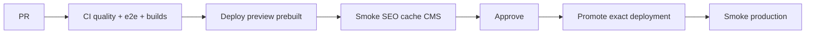

# Preview → promote → rollback

Promote **exactly** the artifact that passed preview checks. Do not rebuild on promote.

## Flow

## Local / CI steps

1. `ORBITYPE_MOCK=true pnpm run build:server` (or `vercel build` with preview env).
2. Deploy as preview (`vercel deploy --prebuilt`).
3. Against the preview URL:
   - `/` and required CMS slugs return 200
   - `/api/health/live` and `/api/health/ready`
   - `X-Robots-Tag` is `noindex, nofollow` on preview
   - No `localhost` in HTML/sitemap/canonical
   - `/api/health/cache-probe` is `no-store`
   - Optional: mutate a preview connector value → `POST /api/revalidate` → HTML updates
4. Record deployment URL, commit SHA, checklist results.
5. Promote that deployment to production (`vercel promote <url>`).
6. Smoke production: home, form (if enabled), sitemap, health.
7. Practice rollback: promote the previous production deployment.

## Security headers (production)

`vercel.json` ships baseline headers. Middleware adds:

- `noindex` on non-production / `NOINDEX=true` / `/api/**`
- `no-store` on `/api/**`

For HSTS and CSP:

- Enable **HSTS** only after HTTPS + domain are stable (Vercel project or `vercel.json`).
- CSP with nonces for any remaining inline scripts is a follow-up when ConsentScripts / analytics need it; prefer removing inline scripts first.

## Secrets

| Variable               | Vercel                  |
| ---------------------- | ----------------------- |
| `ORBITYPE_API_SQL_KEY` | Yes (runtime)           |
| `ORBITYPE_SQL_API_KEY` | No (authoring)          |
| `FIGMA_*`              | No                      |
| `REVALIDATE_SECRET`    | Yes                     |
| `MAIL_*`               | Yes when email is wired |

Never attach production SQL keys to the `cms-contract` or `e2e-mock` CI jobs.
